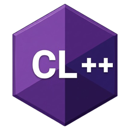

<p align="center">
  
</p>

<h1 align="center">CL++</h1>

<p align="center">
  <strong>A C++-inspired language that compiles to <a href="https://luau.org">Luau</a>.</strong><br>
  Syntax, semantics, and OOP — not a Roblox SDK.
</p>

<p align="center">
  <a href="https://kartzrbx.github.io/CLPP/"></a>
  <a href="https://github.com/KartzRbx/CLPP/actions/workflows/ci.yml"></a>
  <a href="LICENSE"></a>
  <a href="https://luau.org"></a>
</p>

<p align="center">
  <a href="https://kartzrbx.github.io/CLPP/">Course</a>
  ·
  <a href="https://kartzrbx.github.io/CLPP/docs/reference">Reference</a>
  ·
  <a href="https://kartzrbx.github.io/CLPP/api/Builtins">API</a>
  ·
  <a href="https://github.com/KartzRbx/Cluaupp">Cluaupp</a>
</p>

---

CL++ is the **language**. You write C++-looking source; `clpp` emits one Luau file. [Cluaupp](https://github.com/KartzRbx/Cluaupp) owns engine headers, Rojo, and project `init`.

```clpp
link @clpp.roblox;

void init() {
    Players players = GetService<Players>();
    players.PlayerAdded~>Connect(func (Player player) {
        post("hello, " .: player.Name);
    });
}
```

## Files

| File | Becomes |
| --- | --- |
| `*.clh` | Header — `struct`, constants, prototypes |
| `*.clp` | Module implementation |
| `*.clpp` | Script implementation |
| `*.server.clpp` | Roblox **Script** |
| `*.client.clpp` | Roblox **LocalScript** |
| untagged `.clpp` | **ModuleScript** |

There is no `int main()`. Scripts start at `void init()`.

## Accessors

CL++ does **not** use `->`.

| Write | Meaning | Luau |
| --- | --- | --- |
| `player.Name` / `player.Kick()` | property / instance method | `.` / `:` |
| `age: int` / `player:Kick()` | type / protected call | `: ` / `pcall` |
| `task::wait` / `signal::Connect` | static / manual Connect | `.` / `:` |
| `"hi " .: name` | concat | `..` |
| `signal~>Connect(fn)` | janitor Connect | `janitor:Add(..., "Disconnect")` |

`null` is empty. Range-for is `for (T x in list)`.

## Install

**[Download the Windows installer](https://github.com/KartzRbx/CLPP/releases/latest/download/clpp-setup.exe)** — double-click `clpp-setup.exe`. It puts `clpp` on your machine and installs the editor pack.

From source:

```bash
cargo install --path .
clpp setup
```

```bash
clpp compile hello.server.clpp
clpp build
clpp api compile          # JSON stdin/stdout — Cluaupp contract
clpp api complete         # IDE completions from the AST
clpp fmt hello.server.clpp
```

## Docs

The site is a **user guide** (install, tutorials, style) plus a [cplusplus.com-style reference](https://kartzrbx.github.io/CLPP/docs/reference) and a [specification](https://kartzrbx.github.io/CLPP/docs/spec/compiler) (Pest EBNF, type table, emit). Built with Starlight.

```bash
npm run docs          # local Starlight
npm run docs:build    # static → www/dist  (gitignored)
```

Live: **[kartzrbx.github.io/CLPP](https://kartzrbx.github.io/CLPP/)**.

Code fences on the docs site use the language id **clpp** (not `cpp`).

## Layout

```
src/              compiler (parse, analysis, builtins, Luau emit)
docs/             user guide, spec, per-utility reference
www/              Starlight / Astro docs site
moonwave/         legacy API stubs (redirected to the reference)
examples/         leaderstats, Fusion, Vide, combat
stdlib/           IntelliSense headers
editors/vscode    language pack (LSP calls `clpp api complete`)
tools/lsp         launcher (`node tools/lsp/server.js` → editors/vscode)
support/          Cluaupp TypeScript contract
```

## License

[MIT](LICENSE)
