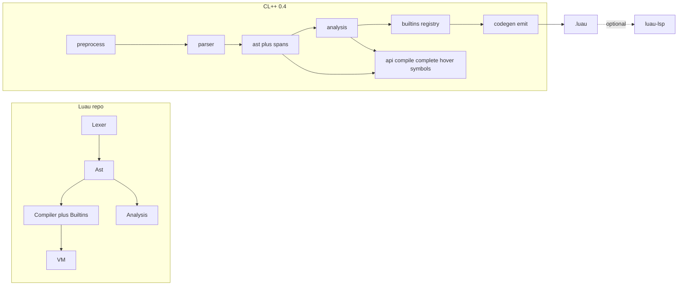

CL++ copies **layering** from [Luau](https://github.com/luau-lang/luau), not the virtual machine. IntelliSense comes from **analysis of the CL++ AST**, the same idea as Luau `Analysis/` feeding [luau-lsp](https://github.com/JohnnyMorganz/luau-lsp).

## Folder map

| Luau | Purpose | CL++ |
| --- | --- | --- |
| `Ast/` | Nodes, visitors, names | [`src/ast/`](../../src/ast/) — spans + visitor |
| `Compiler/` + [`Builtins.cpp`](https://github.com/luau-lang/luau/blob/master/Compiler/src/Builtins.cpp) | Lowering + builtin table | [`src/builtins/`](../../src/builtins/) + [`src/codegen/emit/`](../../src/codegen/emit/) |
| `Analysis/` | Types, lints, IDE data | [`src/analysis/`](../../src/analysis/) — `complete_at`, hover, symbols |
| `Config/` | `.luaurc` | `.clpprc` (optional) + `#pragma` |
| `Require/` | Module paths | [`src/preprocess.rs`](../../src/preprocess.rs) |
| `CLI/` | `luau`, `luau-analyze` | `clpp compile`, `clpp api compile`, `clpp api complete`, `clpp api hover`, `clpp api symbols`, `clpp fmt`, `clpp watch` |
| `VM/`, `CodeGen/` | Native runtime | **Out of scope.** Luau runs the emitted `.luau` |

## Analysis feeds the editor

Luau-lsp does not regex the buffer for locals. CL++ 0.4 matches that contract:

1. Editor sends `{ source, fileName, line, column }` (1-based).
2. `clpp api complete` (or hover / symbols / definition) parses the buffer, walks scopes, returns JSON.
3. The VS Code / Cursor pack is a thin LSP: it does not re-implement the type checker in JavaScript.

Roblox class dumps stay Cluaupp headers + `completions.json` catalog. The language server for **emitted** Luau remains [luau-lsp](https://marketplace.visualstudio.com/items?itemName=JohnnyMorganz.luau-lsp) plus a Rojo sourcemap — complementary, not a substitute.

## Builtins (Luau `Builtins.cpp` lesson)

Luau resolves `math.abs` only when `math` is still the default global. CL++ uses one registry ([`src/builtins`](../../src/builtins/)):

- `post` → `print`
- `report` → `error`
- `to_string` → `tostring`
- `to_number` → `tonumber`
- `to_bool` → `not not`
- `GetService`, `~>Connect`, observables

The same table feeds `clpp api manifest`, codegen, and completions. Locals that shadow a builtin are not rewritten.

## What CL++ will not copy

- A CL++ bytecode VM or opcode table
- Fastcall lowering (`LBF_*` IDs) — those belong to Luau’s compiler
- Replacing luau-lsp for `.luau` files

See the [compiler pipeline](../spec/compiler.md).
