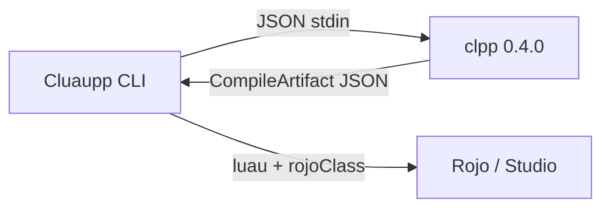

# Update Cluaupp for CL++ 0.4

This page is the **handoff for the Cluaupp CLI**. Pin **CL++ 0.7.0**. See also [Cluaupp 0.7.0 handoff](cluaupp-070). Call the `clpp` binary. Do not reimplement the compiler, do not embed a VM, and do not generate C++-looking source that 0.7.0 rejects.

CL++ is the **language** (parse → analysis → Luau). Cluaupp owns **Roblox wiring**: generated Instance headers, Rojo, project `init`, package install.



Canonical types: [`support/cluaupp.d.ts`](https://github.com/KartzRbx/CLPP/blob/main/support/cluaupp.d.ts). Anonymous-callback rewrite: [Cluaupp — anonymous callbacks](cluaupp-callbacks).

## 1. Pin the compiler

| Check | Command | Expect |
| --- | --- | --- |
| Version | `clpp --version` | `clpp 0.4.0` |
| Manifest | `clpp api manifest` | `"version": "0.4.0"`, `"id": "clpp"` |

Install (Windows):

- [clpp-setup.exe](https://github.com/KartzRbx/CLPP/releases/download/v0.4.0/clpp-setup.exe)
- Or `clpp setup` from a 0.4.0 binary

Locate the exe (in this order):

1. `process.env.CLPP` if Cluaupp already has a setting
2. `clpp` on `PATH`
3. `%LOCALAPPDATA%\Programs\CLPP\clpp.exe`

Refuse to compile if `clpp --version` is older than **0.4.0**. A 0.1.0 / 0.2.x / 0.3.x binary will miss analysis-backed IDE APIs (`complete` / `hover` / `symbols`), `clpp fmt`, and `clpp watch`.

Release: [v0.4.0](https://github.com/KartzRbx/CLPP/releases/tag/v0.4.0).

## 2. Commands Cluaupp should call

```bash
clpp api compile                 # JSON CompileRequest on stdin → CompileArtifact on stdout
clpp api compile --file path     # same artifact, source read from disk
clpp api manifest                # language metadata
clpp api complete                # IDE: { source, fileName, line, column } 1-based
clpp api hover
clpp api symbols
clpp compile path.clpp --json    # same CompileArtifact as api compile --file
clpp build src -o out --json     # { ok, count, output, files }
clpp fmt path.clpp               # indent (optional)
clpp watch src -o out            # recompile on change (optional)
```

**Default compile path for Cluaupp is `clpp api compile` with JSON on stdin.** That is the stable contract. `clpp compile` without `--json` writes Luau text only — use it for humans, not for Rojo mapping.

Exit code:

- `0` — `ok: true`
- `1` — `ok: false` (JSON still on **stdout**)

Parse **stdout** as JSON. Do not scrape stderr for the artifact.

### Node — do not block the Cluaupp event loop

`spawnSync` is fine for a one-shot CLI subcommand. A watch, language host, or long-lived Node process must use `spawn`:

```js
const { spawn } = require("child_process");

function compileSource(source, fileName, options = {}) {
  return new Promise((resolve, reject) => {
    const child = spawn("clpp", ["api", "compile"], { windowsHide: true });
    let stdout = "";
    let stderr = "";
    child.stdout.setEncoding("utf8");
    child.stderr.setEncoding("utf8");
    child.stdout.on("data", (chunk) => (stdout += chunk));
    child.stderr.on("data", (chunk) => (stderr += chunk));
    child.on("error", reject);
    child.on("close", (code) => {
      let artifact;
      try {
        artifact = JSON.parse(stdout);
      } catch {
        reject(new Error(stderr.trim() || `clpp api compile failed (${code})`));
        return;
      }
      if (!artifact.ok) {
        const err = new Error(artifact.error || "clpp compile failed");
        err.diagnostics = artifact.diagnostics || [];
        err.artifact = artifact;
        reject(err);
        return;
      }
      resolve(artifact);
    });
    child.stdin.end(
      JSON.stringify({
        source,
        fileName,
        strict: options.strict ?? null,
      })
    );
  });
}
```

Rust in-process (optional; most Cluaupp builds should keep spawning the binary):

```rust
use clpp::{compile_request, CompileRequest};

let art = compile_request(&CompileRequest {
    source: src.into(),
    file_name: "boot.server.clpp".into(),
    strict: Some(true),
})?;
```

## 3. JSON contract

### CompileRequest (stdin)

| Field | Type | Notes |
| --- | --- | --- |
| `source` | string | Full file text |
| `fileName` | string | Used for tags (`.server.clpp`), includes, `outputHint`. Alias `file_name` is accepted. |
| `strict` | boolean? | Overrides `#pragma strict` / `nostrict` when set |

```json
{
  "source": "void init() { post(\"ok\"); }",
  "fileName": "init.server.clpp"
}
```

`fileName` **must** look like a real source path (`Hello.server.clpp`, not `untitled.txt`). `rojoClass` and `scriptKind` are derived from that name.

### CompileArtifact (stdout)

```json
{
  "ok": true,
  "luau": "-- Compiled by CL++ …",
  "fileName": "init.server.clpp",
  "outputHint": "init.server.luau",
  "scriptKind": "server",
  "isScript": true,
  "isHeader": false,
  "rojoClass": "Script",
  "libraries": ["Janitor", "DataService"],
  "diagnostics": []
}
```

| Field | Meaning for Cluaupp |
| --- | --- |
| `ok` | Write Luau only when `true` |
| `luau` | File body for Rojo |
| `outputHint` | Suggested `.luau` file name (same stem, tags kept: `Foo.server.luau`) |
| `scriptKind` | `"server"` \| `"client"` \| `"plugin"` \| `null` (module) |
| `isScript` | Tagged script (server / client / plugin) |
| `isHeader` | `.clh` |
| `rojoClass` | `"Script"` \| `"LocalScript"` \| `"ModuleScript"` — use this, do not re-parse the filename |
| `libraries` | Runtime libs implied by `#include <clpp/libs/…>` — Cluaupp should `require` / vendor these |
| `error` | Present when `ok` is false |
| `diagnostics` | `{ message, line, column, severity }[]`. **Line and column are 1-based.** |

Failure example:

```json
{
  "ok": false,
  "luau": "",
  "fileName": "init.server.clpp",
  "outputHint": "",
  "scriptKind": null,
  "isScript": false,
  "isHeader": false,
  "rojoClass": "ModuleScript",
  "libraries": [],
  "error": "use func (params) { } — CL++ does not use captures []",
  "diagnostics": [
    {
      "message": "use func (params) { } — CL++ does not use captures []",
      "line": 12,
      "column": 5,
      "severity": "error"
    }
  ]
}
```

Show `diagnostics` in the Cluaupp UI. `error` is the first message plus miette wrapping — do not parse the miette box-drawing.

### LanguageManifest (`clpp api manifest`)

Confirm `version` is `0.4.0`. Use `tags` for Rojo scaffolding if you generate files:

| pattern | scriptKind | rojoClass |
| --- | --- | --- |
| `*.server.clpp` | server | Script |
| `*.client.clpp` | client | LocalScript |
| `*.plugin.clpp` | plugin | Script |
| `*.clp` | module | ModuleScript |
| `*.clh` | header | ModuleScript |

Untagged `*.clpp` is **not** in the tag list. Treat it as `scriptKind: null`, `rojoClass: ModuleScript`.

`operators` and `io` in the manifest are the authoritative accessor / print map. Do not keep a second table in Cluaupp that still has `->`.

## 4. Language Cluaupp must generate

Every template, snippet, `init` scaffold, test fixture, and code-mod that **writes `.clpp` / `.clp` / `.clh`** must match this surface. The JSON schema did not grow a new compile endpoint; the **source language** did.

### Files

| Write | Becomes |
| --- | --- |
| `*.clh` | Header — `struct`, constants, prototypes |
| `*.clp` | Module implementation |
| `*.server.clpp` | Script + `void init()` |
| `*.client.clpp` | LocalScript + `void init()` |
| `*.plugin.clpp` | Plugin Script |
| untagged `*.clpp` | ModuleScript |

There is no `int main()`. Scripts start at `void init()`.

### Accessors (wrong token = wrong Luau)

| Write | Meaning | Luau |
| --- | --- | --- |
| `player.Name` / `player.Kick()` | property / instance method | `.` / `:` |
| `age: int` / `player:Kick()` | type / protected `pcall` | Luau `:` / `pcall` |
| `task::wait` / `Class::Method` / `signal::Connect` | static, method **definition**, manual Connect | `.` / `:` |
| `"hi " .: name` | concat | `..` |
| `signal~>Connect(fn)` / `~>Once` | Janitor Connect / Once | `janitor:Add(..., "Disconnect")` |
| `items[0]` / `data["Coins"]` | index **only** | `[key]` |

Do **not** emit `->`. Do **not** emit `+` for string join.

### Types

Write the class name. **No pointer star in generated source or docs Cluaupp shows users.**

```clpp
Player player = null;
void HelloServer::Greet(Player player) { }
func (Player playerEntered) { }
match (inst) {
    Part p => { }
}
```

The compiler may still strip a trailing `*` if old files sneak through. Cluaupp must not teach or generate `Player*`.

### Callbacks

Always:

```clpp
players.PlayerAdded~>Connect(func (Player playerEntered) {
    post("hello, " .: playerEntered.Name);
});

pcall(func () {
    return 1;
});

game.BindToClose(func () {
    janitor.Cleanup();
});
```

Zero parameters: `func () { }`.

**Do not emit** `func [](…)`, `[]() { }`, `func []() { }`. `[]` is indexing only.

### OOP

```clpp
struct Service {
    Janitor janitor;
    void Tick();
};

void Service::Tick() {
    @janitor.Cleanup();
    @this;
}
```

- Define methods with `Class::Method`.
- Call methods with `.` (`service.Tick()`).
- Inside methods: `@this` → `self`, `@field` → `self.field`. Bare `this` is the same alias.
- `@this` / `@janitor` in `void init()` or a free function is a **compile error**. Keep Janitor on the instance, or use a local `Janitor janitor` in `init` (see leaderstats example).

### Includes Cluaupp / projects should write

```clpp
#include <clpp/roblox.clh>                 // IntelliSense only — no Luau emitted
#include <clpp/generated/instances.clh>    // Cluaupp-generated Instance dump
#include <clpp/datatypes.clh>
#include <clpp/libs/janitor.clh>           // IntelliSense + require; artifact.libraries includes "Janitor"
#include <clpp/libs/dataservice.clh>       // libraries: "DataService"
#include "LeaderstatsServer.clh"           // same stem as the .clpp → inlined
#include "../shared/PlayerData.clh"        // other stem → require
```

`#include <clpp/libs.clh>` sets `libraries` to `["*"]` (all bundled libs). Prefer the specific header.

Angled `clpp/roblox.clh` does **not** pull in a live API dump. Missing `ProximityPrompt` is a **Cluaupp generated-header** problem.

### I/O and conversions

`post` → `print` · `warn` → `warn` · `report` → `error` · `to_string` / `to_number` / `to_bool` · `null` (not `nullptr`).

### Control flow Cluaupp scaffolds may use

`if` / `else` · `while` · C-for · `for (T x in xs)` · `guard (cond) else { }` · `match { Type name => { } }` · `spawn { }` · `async` / `await`.

Do not generate `continue`, ternary `? :`, `do/while`, `try/catch`, `goto`.

## 5. Stop generating this

| Old Cluaupp / C++ habit | 0.4.0 |
| --- | --- |
| `Player* player` | `Player player` |
| `player->Name` | `player.Name` |
| `this->janitor` | `@janitor` inside `Class::Method` |
| `func [](Player p) { }` / `[]() { }` | `func (Player p) { }` / `func () { }` |
| `"hi " + name` | `"hi " .: name` |
| `players.PlayerAdded:Connect` as the default | `~>Connect` (Janitor) or `::Connect` (manual) |
| `int main()` | `void init()` |
| `std::` / `new int` / `delete` | not in the language |
| `clpp` 0.1.0 on PATH | replace with 0.4.0 (`clpp setup`) |

If a Cluaupp test still asserts that `func []` compiles, invert it: `ok` must be `false` and the diagnostic must mention `func (params)`.

## 6. Golden scaffolds

Copy these shapes. They compile on 0.4.0.

### Hello Script (`hello.server.clpp`)

```clpp
#include <clpp/roblox.clh>

struct HelloServer {
    void Greet(Player player);
};

void HelloServer::Greet(Player player) {
    post("Player name: " .: player.Name);
}

void init() {
    HelloServer hello;
    Players players = GetService<Players>();

    for (Player player in players.GetPlayers()) {
        hello.Greet(player);
    }

    players.PlayerAdded~>Connect(func (Player playerEntered) {
        hello.Greet(playerEntered);
    });
}
```

Expect `rojoClass: "Script"`, `scriptKind: "server"`, Luau containing `game:GetService("Players")` and `janitor:Add`.

### Service + `@this` (methods only)

```clpp
void LeaderstatsServer::PlayerEntered(Player player) {
    string key = @this.GetPlayerJanitorKey(player);
    @janitor.Add(folder, "Destroy", key);
}
```

`void init()` holds the singleton and a local Janitor if needed — it must not use `@this`.

## 7. What Cluaupp still owns

CL++ will not:

- Generate the Roblox API dump (`clpp/generated/instances.clh`)
- Write `default.project.json` / Rojo trees
- Install Wally / npm game packages
- Run Studio

Cluaupp should:

1. Ensure `clpp` 0.4.0 is on the machine (or ship / download that exact release).
2. Generate headers from the API dump into the include path `clpp` searches.
3. Create `.server.clpp` / `.client.clpp` / `.clh` using the language above.
4. Call `clpp api compile` per file (or `clpp build` for a tree).
5. Place `artifact.luau` using `outputHint` and set the Rojo class from `rojoClass`.
6. Vendor or `require` each name in `artifact.libraries`.
7. After shipping a new `clpp`, tell users to `clpp setup` (or `clpp install`) and **reload** the editor so `@this` highlighting and the `func (` lint match the compiler.

The editor LSP (`editors/vscode`, `clpp.lsp.enabled`) is **not** a Cluaupp API. Do not speak JSON-RPC to it. Completions in Cursor/VS Code come from `clpp api complete` (analysis). Cluaupp only **needs** `clpp api compile` for Rojo.

## 8. Cluaupp repo checklist

1. **Dependency** — document / download CL++ **0.4.0**; fail fast on older `clpp --version`.
2. **Spawn** — `clpp api compile` with JSON stdin; parse stdout; surface `diagnostics`.
3. **`init` templates** — hello world, leaderstats, Fusion/Vide, DataService: `func (`, `.:`, `.` methods, `~>Connect`, `Player player`, `@this` only in `Class::Method`.
4. **Snippets / codegen** — delete string templates containing `func []`, `[](`, `->`, `Player*`.
5. **Golden `.clpp` fixtures** — rewrite and recompile with 0.4.0; commit the new Luau if you snapshot emit.
6. **Docs / UI copy** — language id `clpp`; fences on sites Cluaupp controls should not be `cpp`.
7. **Tests** — `func []` fails; `Player*` is not produced; `clpp api manifest` version is `0.4.0`.
8. **Headers** — keep generating `clpp/generated/instances.clh`; do not expect CL++ to ship a live dump.

## 9. Quick verification

```bash
clpp --version
# clpp 0.4.0

echo '{"source":"void init() { post(\"ok\"); }","fileName":"init.server.clpp"}' | clpp api compile
# ok true, rojoClass Script, luau contains print("ok")

echo '{"source":"void init() { []() {} }","fileName":"bad.server.clpp"}' | clpp api compile
# ok false, diagnostics mention func (params)
```

In-tree examples that must keep compiling:

- `examples/hello/hello.server.clpp`
- `examples/leaderstats/LeaderstatsServer.server.clpp`
- `examples/advanced/CombatServer.server.clpp`

## See also

[Cluaupp](cluaupp) · [JSON contract](cluaupp-support) · [Anonymous callbacks](cluaupp-callbacks) · [Operators](operators) · [@this](reference/this) · [Compiler pipeline](spec/compiler) · [TypeScript types](https://github.com/KartzRbx/CLPP/blob/main/support/cluaupp.d.ts)
