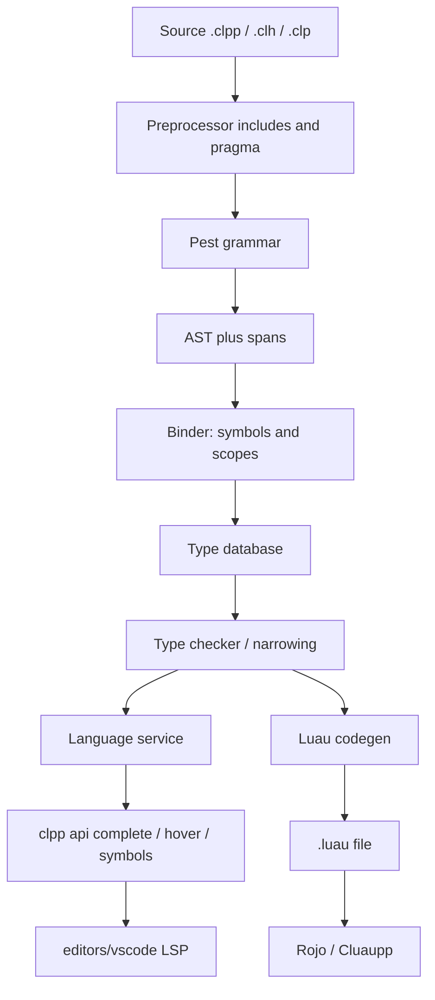

CL++ is a **source-to-source** compiler. Pest parses `.clpp` / `.clh` / `.clp`. **Analysis** builds scopes and feeds the editor. Codegen writes Luau. There is no CL++ virtual machine, no opcode table, and no C++ embedding API — host tools call `clpp compile` or `clpp api compile`.

How this maps to the [Luau](https://github.com/luau-lang/luau) repo: [Luau engineering map](../architecture/luau-mapping).



## Stages

| Stage | Where | Output |
| --- | --- | --- |
| Include / pragma | `src/preprocess` | One translation unit; comments keep source lines |
| Parse | `src/parser/grammar.pest` | AST (recovery for the IDE after the first Pest error) |
| Analysis | `src/analysis` + `src/session` + `src/checker` | Diagnostics, symbols, completions, hover, outline |
| Binder | `src/binder` + `src/symbols` + `src/types` | Symbol table and interned types |
| Builtins | `src/builtins` | One table for emit, manifest, and IDE |
| Emit | `src/codegen/emit` | Luau (`function Class:Method`, `self`, `game:GetService`) |
| Editor | `editors/vscode` | LSP calls `clpp api complete` |

## Host tools

Cluaupp (and anything else) should use:

```bash
clpp api compile      # JSON stdin/stdout
clpp api complete     # { source, fileName, line, column } 1-based
clpp api hover
clpp api symbols
clpp api definition
clpp manifest         # extensions, tags, operators, builtins
clpp fmt              # indent
clpp watch            # recompile on change
```

See [Cluaupp 0.7.0](../cluaupp-070), [Update Cluaupp](../cluaupp-032), [CL++ + luau-lsp](../architecture/luau-lsp), and [Cluaupp support](../cluaupp-support). Current compiler: **0.7.0**.
