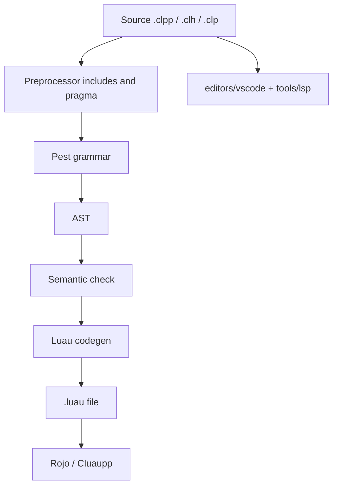

CL++ is a **source-to-source** compiler. Pest parses `.clpp` / `.clh` / `.clp`. Semantic check runs on that AST. Codegen writes Luau. There is no CL++ virtual machine, no opcode table, and no C++ embedding API — host tools call `clpp compile` or `clpp api compile`.



## Stages

| Stage | Where | Output |
| --- | --- | --- |
| Include / pragma | `src/preprocess` | One translation unit |
| Parse | `src/parser/grammar.pest` | AST |
| Check | `src/semantic/check.rs` | Diagnostics; `@this` only in `Class::Method` |
| Emit | `src/codegen/luau.rs` | Luau (`function Class:Method`, `self`, `game:GetService`) |
| Editor | `editors/vscode` | Highlight, completion, hover, LSP |

## Grammar

The formal syntax is the [EBNF subset](grammar) plus the Pest file in the repo. That is the parser. It is not Tree-sitter and not ISO C++.

## Host tools

Cluaupp (and anything else) should use:

```bash
clpp api compile    # JSON stdin/stdout
clpp manifest       # extensions, tags, operators
```

See [Update Cluaupp for CL++ 0.3.2](../cluaupp-032) and [Cluaupp support](../cluaupp-support). Current compiler: **0.3.3**.
